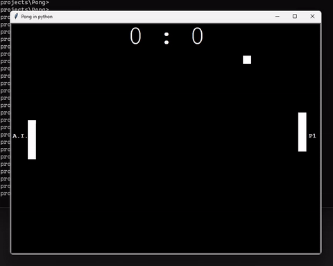

# Retro Pong Game: Single-player vs AI. Classic arcade in Python

## Overview

This repository contains a simple retro-styled Pong game written in Python. It's a classic arcade game where two players control paddles to hit a ball back and forth. In This version a single-player plays an A.I. opponent

## License
This Pong game is open-source and available under the MIT License.

## Author
zeyad elgendi
GitHub: zeyad-elgendi
